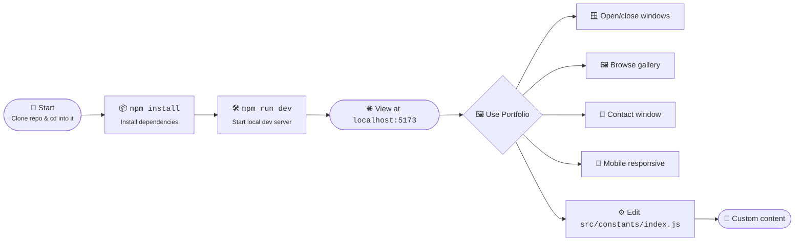
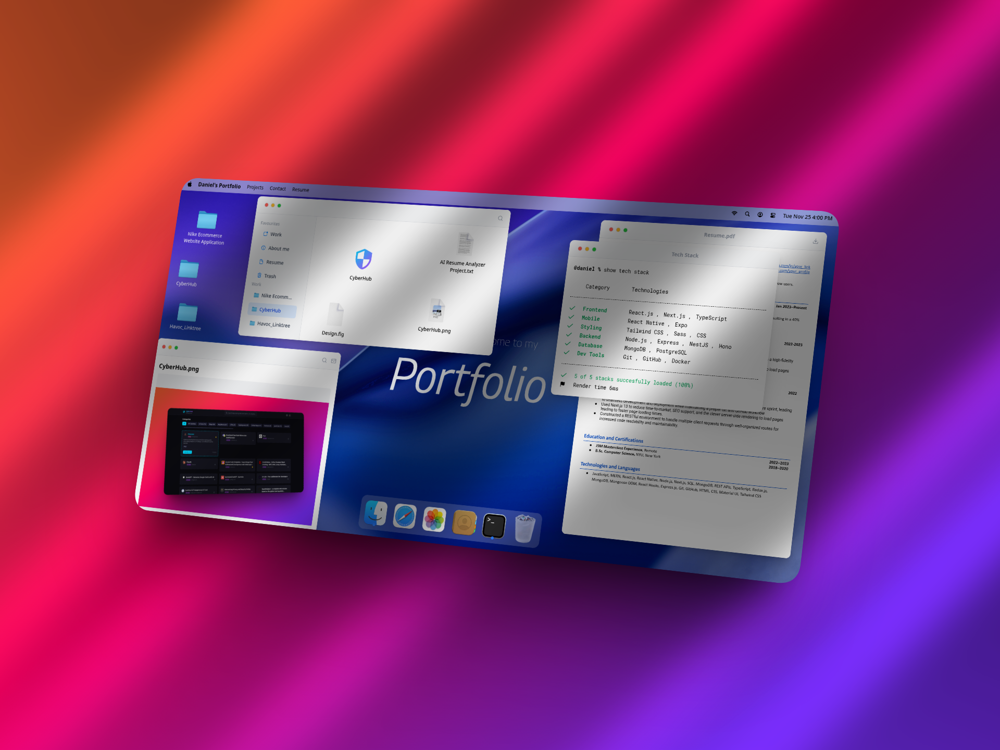

<h1 align="center">Daniel Wambua - macOS Portfolio</h1>
<p align="center">
<a href="https://github.com/Daniel-wambua/macOS_portfolio"><br /></a>
<i>This repo contains the source for my personal macOS-style portfolio</i>
<br />
<i>A React web app with authentic macOS UI, gallery, and window management</i>
<br />
<b>🌐 <a href="https://portfolio.havocsec.me">portfolio.havocsec.me</a></b> <br />
</p>


## Motive
To showcase my work, skills, and personality in a unique, interactive way.
All content and UI are defined in code, with a focus on automation, maintainability, and a true macOS experience.
I built this so I never have to use a boring template portfolio again.

<details>
  <summary>About the Developer</summary>

> **Professional Background**<br>
> I'm an experienced, Principal-level full stack engineer with a passion for security, quality, performance, mentoring, technology and open source. I believe the best judge of a developer is their code, and while I cannot share proprietary work, I have many open source projects on my [GitHub](https://github.com/Daniel-wambua) and showcase my skills at [lab.havocsec.me](https://lab.havocsec.me).
>
> This portfolio project reflects my philosophy: why settle for generic when you can build something truly yours? I love automating, customizing, and making my work stand out.

</details>

---

## About

This portfolio is a macOS-inspired React app featuring:
- Authentic window management (Finder, Photos, Contact, Resume, etc.)
- Multi-category photo gallery with sidebar filtering
- Responsive Dock, Navbar, and window controls
- Mobile-first, fully responsive design
- Contact window with Linktree and social links
- All data (gallery, links, socials) in `/src/constants/index.js`
- Zustand for window state management
- Tailwind CSS for styling

Why? ...Because why spend 30 minutes on a template, when you could spend 30 hours building something unique!

---

## Usage

### Option #1 - Online
1. Visit <a href="https://macfolio.havocsec.me">macfolio.havocsec.me</a> to see the live portfolio.

### Option #2 - Local
1. Clone the repo
2. Run `npm install` or `yarn install`
3. Run `npm run dev` or `yarn dev`
4. Open [http://localhost:5173](http://localhost:5173) in your browser

---

## Project Structure

```
macOS_portfolio/
├── public/                # Static assets
├── src/
│   ├── assets/            # Images and icons
│   ├── components/        # UI components (WindowControls, Navbar, etc.)
│   ├── constants/         # Data for nav, dock, gallery, socials
│   ├── store/             # Zustand window state logic
│   ├── windows/           # App windows (Finder, Photos, Contact, etc.)
│   ├── App.jsx            # Main app shell
│   ├── main.jsx           # Entry point
│   └── index.css          # Tailwind CSS
├── package.json
├── vite.config.js
└── README.md
```
---


---

## Flowchart



---

## Screenshot

<h3 align="center">Web 🌐</h3>
<p align="center"><a href="https://portfolio.havocsec.me"></a></p>

---

## Attribution
This project uses the following open-source libraries and resources:
- [React](https://react.dev/)
- [Vite](https://vitejs.dev/)
- [Zustand](https://zustand-demo.pmnd.rs/)
- [Tailwind CSS](https://tailwindcss.com/)
- [Heroicons](https://heroicons.com/)

## Contributors
- [Daniel Wambua](https://github.com/Daniel-wambua)

## Credits
  [js-mastery](https://jsmastery.com/)for the idea and inspirations.

---

## License

> _**[Daniel Wambua/macOS_portfolio](https://github.com/Daniel-wambua/macOS_portfolio)** is licensed under [MIT](https://github.com/Daniel-wambua/macOS_portfolio/blob/HEAD/LICENSE) © [Daniel Wambua](https://portfolio.havocsec.me) 2025._<br>
> <sup align="right">For information, see <a href="https://tldrlegal.com/license/mit-license">TLDR Legal > MIT</a></sup>

<details>
<summary>Expand License</summary>

```
The MIT License (MIT)
Copyright (c)  Daniel Wambua <daniel@wambua.com>

Permission is hereby granted, free of charge, to any person obtaining a copy 
of this software and associated documentation files (the "Software"), to deal 
in the Software without restriction, including without limitation the rights 
to use, copy, modify, merge, publish, distribute, sub-license, and/or sell 
copies of the Software, and to permit persons to whom the Software is furnished 
to do so, subject to the following conditions:

The above copyright notice and this permission notice shall be included in all 
copies or substantial portions of the Software.

THE SOFTWARE IS PROVIDED "AS IS", WITHOUT WARRANTY OF ANY KIND, EXPRESS OR IMPLIED,
INCLUDING BUT NOT LIMITED TO THE WARRANTIES OF MERCHANTABILITY, FITNESS FOR A
PARTICULAR PURPOSE AND NON INFRINGEMENT. IN NO EVENT SHALL THE AUTHORS OR COPYRIGHT
HOLDERS BE LIABLE FOR ANY CLAIM, DAMAGES OR OTHER LIABILITY, WHETHER IN AN ACTION
OF CONTRACT, TORT OR OTHERWISE, ARISING FROM, OUT OF OR IN CONNECTION WITH THE
SOFTWARE OR THE USE OR OTHER DEALINGS IN THE SOFTWARE.
```

</details>

<!-- License + Copyright -->
<p  align="center">
  <i>© <a href="https://danielwambua.dev">Daniel Wambua</a> 2025</i><br>
  <i>Licensed under <a href="https://gist.github.com/Daniel-wambua/143d2ee01ccc5c052a17">MIT</a></i><br>
  <a href="https://github.com/Daniel-wambua"></a><br>
  <sup>Thanks for visiting :)</sup>
</p>

<!-- Dinosaur -->
<!-- 
                        . - ~ ~ ~ - .
      ..     _      .-~               ~-.
     //|     \ `..~                      `.
    || |      }  }              /       \  \
(\   \\ \~^..'                 |         }  \
 \`.-~  o      /       }       |        /    \
 (__          |       /        |       /      `.
  `- - ~ ~ -._|      /_ - ~ ~ ^|      /- _      `.
              |     /          |     /     ~-.     ~- _
              |_____|          |_____|         ~ - . _ _~_-_
-->

